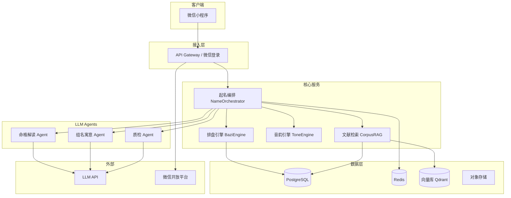
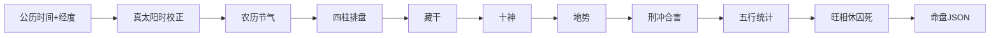
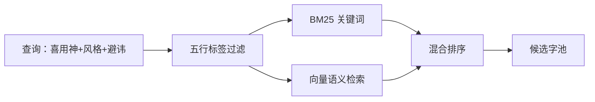
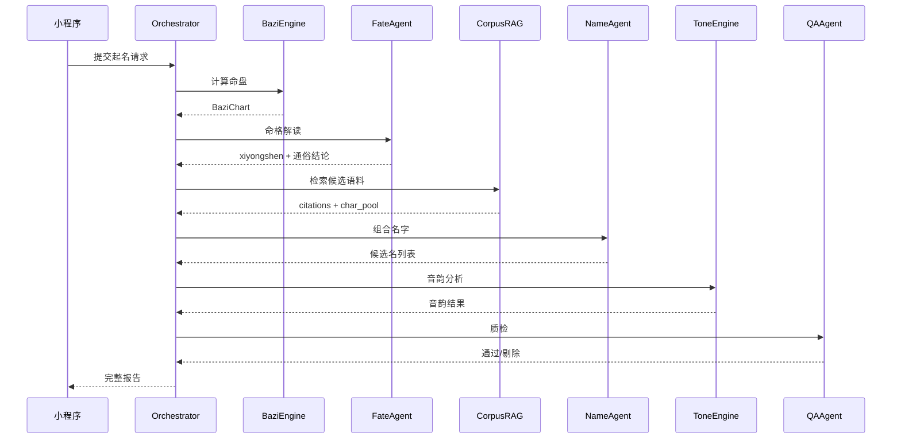
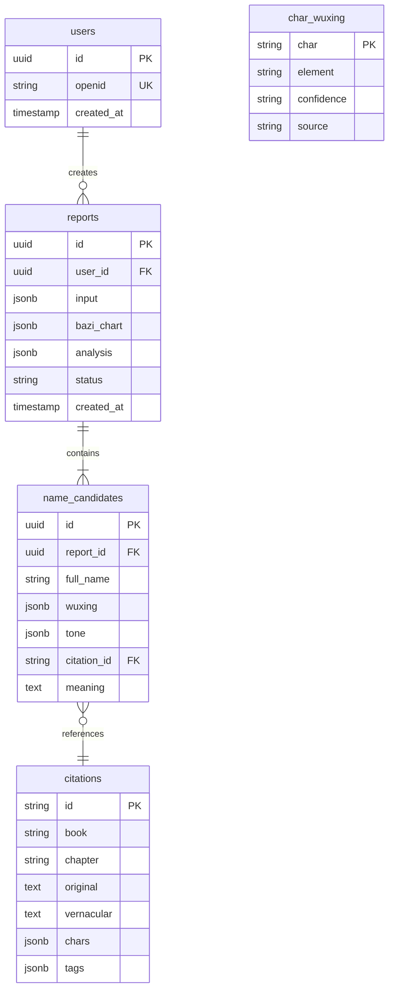
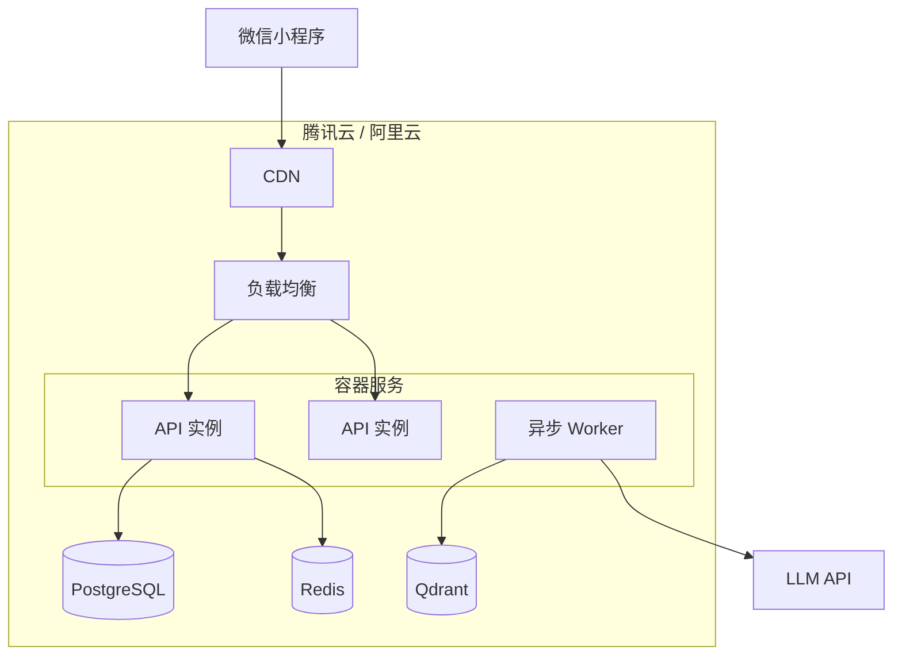

# 系统架构设计

**版本**：v0.1  
**日期**：2026-06-25  
**关联**：[PRD](../PRD.md)、[MVP 边界](./decisions/01-mvp-scope.md)

---

## 1. 架构总览

系统采用**确定性引擎 + RAG + 多 Agent LLM** 分层架构，微信小程序为唯一客户端（首期），后端预留 REST API。



---

## 2. 技术选型建议

| 层级 | 技术 | 理由 |
|------|------|------|
| 小程序 | 微信原生 / uni-app | 原生审核体验好；uni-app 便于后续多端 |
| API | Python FastAPI 或 Node.js NestJS | Python 利于历法库与 NLP；NestJS 利于团队 TS 统一 |
| 排盘引擎 | Python + `lunar-python` / 自研 | 历法计算成熟库 + 自研十神刑冲 |
| 向量检索 | Qdrant / pgvector | 小语料 MVP 可用 pgvector 减运维 |
| 缓存 | Redis | 命盘结果、会话状态 |
| 主库 | PostgreSQL | 用户、报告、语料元数据 |
| LLM | DeepSeek / 通义 / GPT-4o | 中文古文理解优先国内模型 |
| 部署 | 云函数 + 容器混合 | 排盘低延迟容器；LLM 调用可异步 |

---

## 3. 模块详细设计

### 3.1 排盘引擎（BaziEngine）

**职责**：输入公历时间 + 经纬度 → 输出完整命盘 JSON。纯确定性，**零 LLM**。



**核心子模块**：

| 子模块 | 输入 | 输出 |
|--------|------|------|
| `SolarTimeConverter` | 北京时间、经度 | 真太阳时 |
| `PillarCalculator` | 真太阳时 | 年柱月柱日柱时柱 |
| `HiddenStemResolver` | 四柱地支 | 藏干列表 |
| `TenGodAnalyzer` | 日主天干、四柱天干 | 十神 |
| `GrowthStageResolver` | 日主、四柱地支 | 长生十二宫 |
| `RelationDetector` | 四柱地支、天干 | 合化刑冲害 |
| `ElementCounter` | 天干地支藏干 | 五行个数 |
| `SeasonStrength` | 月支、季节 | 旺相休囚死 |

**接口**：

```
POST /api/v1/bazi/calculate
Request:  { birth_datetime, longitude, latitude, gender }
Response: BaziChart (见 MVP 决策文档 JSON schema)
```

**时辰不详降级**：`hour=null` → 时柱置空，返回 `confidence: "degraded"`，月柱日柱仍计算。

---

### 3.2 命格解读 Agent（FateAnalysisAgent）

**职责**：将命盘 JSON 转为专业解读 + 通俗结论 + 喜用神列表。

**输入**（结构化，禁止 LLM 自行排盘）：

```json
{
  "chart": { "...": "BaziEngine 输出" },
  "knowledge_snippets": ["调候规则：冬丙宜火", "寅申冲：..."],
  "output_mode": "mvp" | "full"
}
```

**输出**：

```json
{
  "professional": "专业层 Markdown（v1.0）",
  "vernacular": "3-5 句通俗结论",
  "xiyongshen": { "primary": ["火"], "secondary": ["木"], "avoid": ["水"] },
  "reasoning_chain": ["步骤1", "步骤2"]
}
```

**Prompt 约束**：
- 喜用神必须与 `reasoning_chain` 一致
- 禁止编造刑冲合害（仅引用 chart.relations）
- MVP 模式 `professional` 可为空

**知识库**：调候表、十神释义、常见格局说明 → 检索后注入 Prompt。

---

### 3.3 文献检索（CorpusRAG）

**职责**：按喜用神、风格、性别检索候选字与出处片段。



**检索流程**：

1. 从汉字五行库取 `element ∈ xiyongshen` 的字集
2. 排除避讳字、生僻字（`frequency < threshold`）、`exclude_naming` 标签语料
3. 混合检索：BM25（字/词） + embedding（意象：「光明」「悠远」）
4. 返回 Top-K 语料片段，每片段附可用汉字列表

**接口**：

```
POST /api/v1/corpus/search
Request:  { xiyongshen, style_tags, gender, avoid_chars, limit }
Response: { citations: [{ id, book, original, chars, score }] }
```

**数据管道**（离线）：

```
公版文本 → 分句 → 汉字抽取 → 五行标注 → 标签打标 → 向量化 → 入库
```

---

### 3.4 组名寓意 Agent（NameComposeAgent）

**职责**：从候选字池组合 3～5 个名字，撰写寓意，**不得虚构出处**。

**输入**：

```json
{
  "surname": "侯",
  "citations": [...],
  "char_pool": [...],
  "preferences": { "name_length": 2, "generation_char": null },
  "xiyongshen": { "primary": ["火"], "secondary": ["木"] }
}
```

**输出**（每个名字）：

```json
{
  "full_name": "侯明悠",
  "given_name": "明悠",
  "citation_id": "zhongyong-001",
  "citation_text": "天地之道，博也，厚也，高也，明也，悠也，久也。",
  "vernacular": "...",
  "meaning": "结合命格的寓意解读",
  "wuxing": { "明": "火", "悠": "火", "summary": "火" }
}
```

**硬约束**（代码校验，非仅靠 Prompt）：
- `citation_id` 须在检索结果中
- 名字每字须在对应语料 `chars` 中
- 五行须通过 `WuxingValidator`

---

### 3.5 音韵引擎（ToneEngine）

**职责**：拼音、平仄判定、拗口风险。纯确定性。

| 功能 | 规则 |
|------|------|
| 拼音 | `pypinyin`，带声调 |
| 平仄 | 阴平、阳平 → 平；上声、去声 → 仄 |
| 推荐模式 | 双字名优先平仄/仄平 |
| 拗口检测 | 同声调连用、难读声母组合 |

**接口**：

```
POST /api/v1/tone/analyze
Request:  { full_name: "侯明悠" }
Response: {
  "syllables": [
    { "char": "侯", "pinyin": "hóu", "tone": "平" },
    { "char": "明", "pinyin": "míng", "tone": "平" },
    { "char": "悠", "pinyin": "yōu", "tone": "平" }
  ],
  "pattern": "平平平",
  "score": 0.6,
  "comment": "三字皆平，略欠起伏，读音清朗"
}
```

MVP：仅返回拼音；v1.0 启用平仄校验与过滤。

---

### 3.6 质检 Agent（QAAgent）

**职责**：报告发出前最后一道检查。

**检查项**：

| # | 检查 | 失败处理 |
|---|------|----------|
| 1 | 典籍出处 ID 可回查 | 剔除该名字 |
| 2 | 无虚构书名 | 剔除 |
| 3 | 五行与喜用神策略一致 | 剔除或降级标注 |
| 4 | 谐音负面词 | 剔除 |
| 5 | 微信内容安全 API | 拦截整份报告 |
| 6 | 喜用神与 FateAgent 一致 | 重新生成 |

---

### 3.7 起名编排器（NameOrchestrator）

**职责**：串联全流程，支持流式进度推送。



**流式进度**（WebSocket 或 SSE）：

```
1/5 正在排盘...
2/5 正在分析命格...
3/5 正在检索经典文献...
4/5 正在生成备选名字...
5/5 正在完成质检...
```

**失败重试**：组名失败最多 3 轮，每轮扩大检索范围。

---

## 4. 数据模型（核心表）



---

## 5. API 设计摘要

| 方法 | 路径 | 说明 | MVP |
|------|------|------|-----|
| POST | `/api/v1/auth/wechat` | 微信 code 换 session | ✅ |
| POST | `/api/v1/bazi/calculate` | 排盘 | ✅ |
| POST | `/api/v1/report/generate` | 异步生成报告 | ✅ |
| GET | `/api/v1/report/{id}` | 获取报告 | ✅ |
| POST | `/api/v1/report/{id}/regenerate` | 换一批名字 | ✅ |
| GET | `/api/v1/report/{id}/stream` | 流式进度 | ✅ |
| POST | `/api/v1/tone/analyze` | 音韵分析 | v1.0 |

---

## 6. 部署架构



**异步报告生成**：`POST /report/generate` 返回 `report_id`，Worker 消费队列完成 LLM 调用，小程序轮询或订阅消息通知。

---

## 7. 安全与隐私

| 措施 | 实现 |
|------|------|
| 传输 | HTTPS / WSS |
| 出生信息 | AES-256 加密字段存储 |
| LLM 调用 | 不传 openid；命盘 JSON 最小化 |
| 接口限流 | 每用户 10 次/天（免费） |
| 日志 | 命盘数据不落日志明文 |

---

## 8. 可观测性

| 指标 | 告警阈值 |
|------|----------|
| 排盘 P99 延迟 | > 1s |
| 报告生成 P99 | > 90s |
| LLM 错误率 | > 5% |
| 出处回查失败率 | > 0%（零容忍） |
| 质检剔除率 | > 30%（提示 Prompt/语料问题） |

---

## 9. 目录结构建议

```
name/
├── quming.txt                 # 黄金范本
├── docs/                      # 产品与架构文档
├── miniprogram/               # 微信小程序
│   ├── pages/
│   └── components/
├── backend/
│   ├── app/
│   │   ├── bazi/              # 排盘引擎
│   │   ├── corpus/            # RAG
│   │   ├── agents/            # LLM Agents
│   │   ├── tone/              # 音韵
│   │   └── api/               # 路由
│   ├── data/
│   │   ├── corpus/            # 语料原文
│   │   └── wuxing/            # 汉字五行库
│   └── tests/
│       └── golden/            # GOLDEN-001
└── scripts/
    └── corpus_ingest.py       # 语料入库
```

---

## 10. 分期实现路线图

| 阶段 | 周期 | 交付 |
|------|------|------|
| **Sprint 1** | 2 周 | BaziEngine + 黄金用例测试通过 |
| **Sprint 2** | 2 周 | 语料入库 MVP 8 部 + RAG 检索 |
| **Sprint 3** | 2 周 | Agents + Orchestrator + API |
| **Sprint 4** | 2 周 | 小程序 UI + 微信登录 + 报告展示 |
| **Sprint 5** | 1 周 | 合规文案 + 内容安全 + 内测 |
| **v1.0** | +4 周 | 完整命盘 UI、平仄、语料扩展 |

---

## 11. 风险与缓解

| 风险 | 缓解 |
|------|------|
| LLM 虚构出处 | 硬约束 citation_id + 回查 |
| 排盘与范本不一致 | 黄金用例 CI 阻断 |
| 微信审核不通过 | 合规文案 + 避免迷信表述 |
| LLM 成本过高 | 缓存命盘解读；组名用小模型 |
| 五行归属争议 | confidence 过滤 + 运营后台 |
